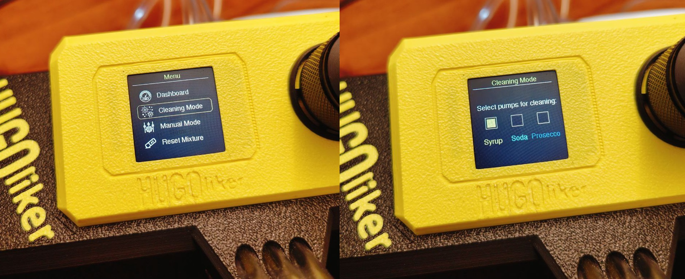
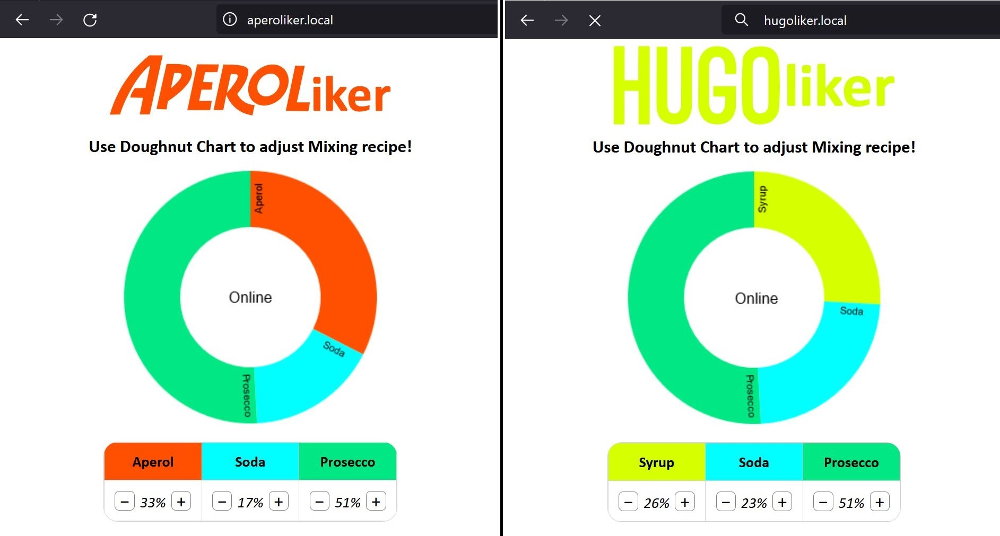

# APEROLiker / HUGOliker / WINEBar
Sourcecode for APEROLiker/HUGOliker/WINEBar Devices powered by ESP32S2 (Wemos S2 Mini)

You can download the 3D print files required for the assembly from Cults.

Device | Link
-------- | --------
APEROLiker / HUGOliker: | <a href="https://cults3d.com/:1705298">https://cults3d.com/:1705298</a> 
WINEBar:                | <a href="https://cults3d.com/:1841218">https://cults3d.com/:1841218</a>
 

Releases:
* V1.0 - Features:
  - Initial Release
* V1.1 - Features:
  - Statemachine has been added. A complete display menu is now available. The cleaning mode no longer has to be activated by plugging in the supply voltage while pressing the encoder button but can be called up in the menu.
  
* V1.2 - Features:
  - Wifi is now available! You can control the Aperoliker via access point. I will show a homepage under "aperoliker.local" or "hugoliker.local". Additionally, you now can use the SPIFFS Uploader to upload the image and webpage files. Statemachine and some other firmware parts were moved to separate files.
  

___

APEROLiker/HUGOliker Promotion Video:

Link: <a href="https://youtu.be/noAwpnZ6lFE">https://youtu.be/noAwpnZ6lFE</a>

___

APEROLiker/HUGOliker Build Guide:

Link: <a href="https://youtu.be/Se7SYwGe9iE">https://youtu.be/Se7SYwGe9iE</a>

___

FAQ:

* Q: Is APEROLiker a real word, or did you just combine Aperol and "liker" for fun?

  A: Oh, it's real, alright! We took the "Aperol" love and mixed it with your newfound "liker" status. It's the lovechild of cocktails and social media approval! (Also, "Alkoholiker" means alcoholic in German, you could also translate it as APEROLic)
  

* Q: Can APEROLiker double as a DJ for my party?

  A: While it hasn't mastered "DJ skills" yet, it does know how to mix up a playlist as diverse as its cocktails. Dance while your drinks get their groove on!
  

* Q: Will APEROLiker judge my taste in making drinks?

  A: No judgment here! APEROLiker believes in a non-discriminatory mixing experience. It'll shake it all!
  

* Q: Can APEROLiker handle complicated drink orders?

  A: Absolutely! APEROLiker is like the James Bond of mixology—cool, collected, and always ready for a challenge. Shaken, stirred, or both, it's got you covered.
  

* Q: Is APEROLiker dishwasher safe, or should I stick to some rules for cleaning?

  A: While it appreciates a good care, APEROLiker prefers a gentle hand wash. Shining can be the post-cleaning celebration.
  

* Q: Can APEROLiker tell jokes while mixing drinks?

  A: It won't be featured at your next comedy club, but if you implement the "humor infusion" button, it might drop a pun or two. Laughter, just like cocktails, is the best mixer.
