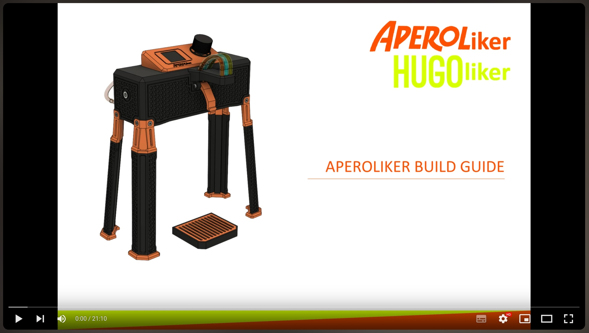

# APEROLiker
Sourcecode for APEROLiker/HUGOliker Devices powered by ESP32S2 (Wemos S2 Mini)

You can download the 3D print files required for the assembly from Cults.

Link: <a href="https://cults3d.com/:1705298">https://cults3d.com/:1705298</a>
 

___

APEROLiker/HUGOliker Build Guide:

Link: <a href="https://youtu.be/Se7SYwGe9iE">https://youtu.be/Se7SYwGe9iE</a>
